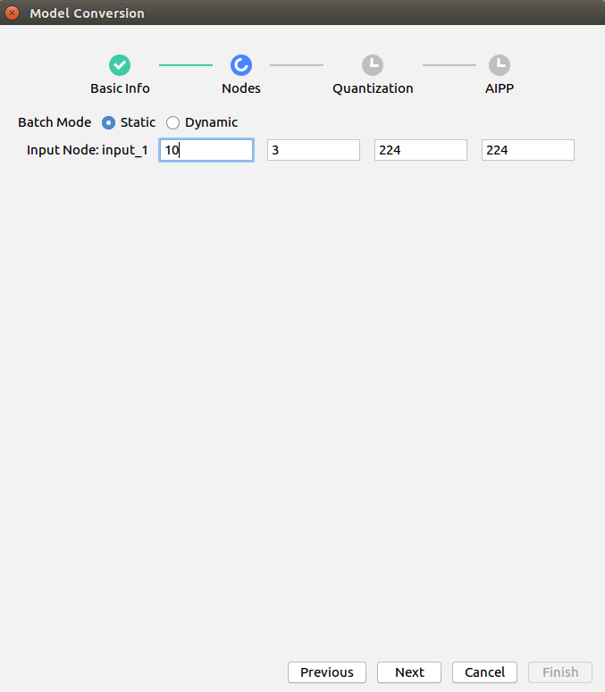
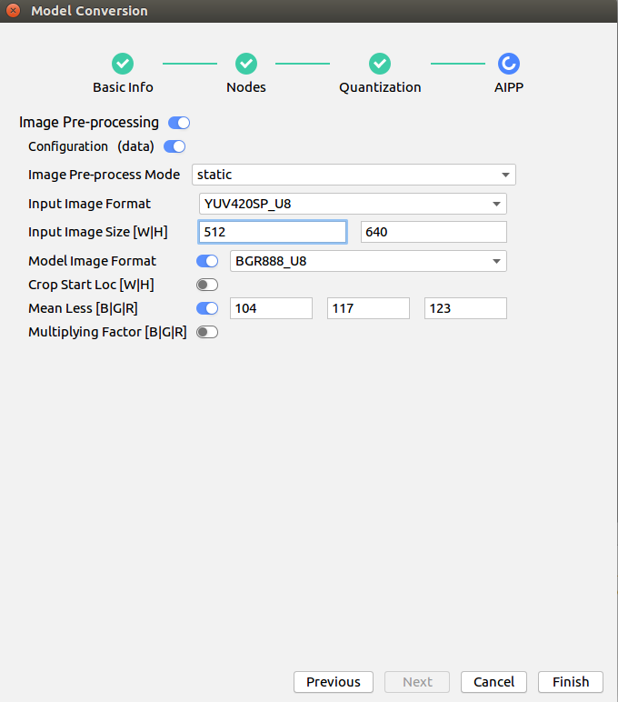
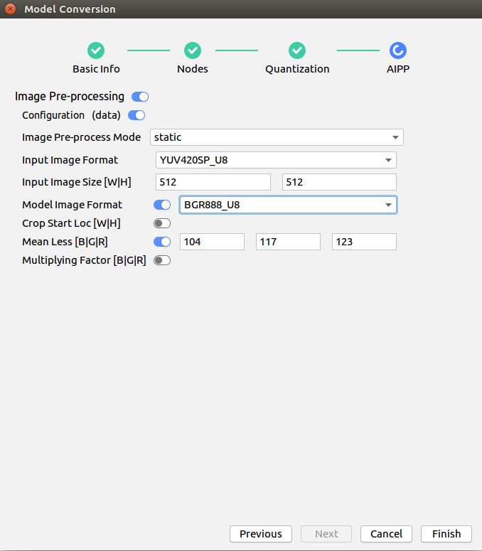
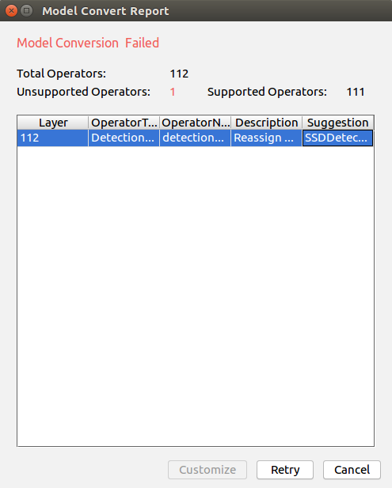

EN|[CN](Readme.md)

# Vehicle Detection<a name="ZH-CN_TOPIC_0208834984"></a>

Developers can deploy the application on the Atlas 200 DK or the AI acceleration cloud server to decode the local MP4 file or RTSP video streams, detect vehicles in video frames, predict their attributes, generate structured information, and send the structured information to the server for storage and display.

## Prerequisites <a name="zh-cn_topic_0203223303_section137245294533"></a>

Before using an open source application, ensure that:

-   Mind Studio  has been installed.
-   The Atlas 200 DK developer board has been connected to  Mind Studio, the cross compiler has been installed, the SD card has been prepared, and basic information has been configured.

## Software Preparation<a name="zh-cn_topic_0203223303_section8534138124114"></a>

Before running the application, obtain the source code package and configure the environment as follows.

1.  <a name="zh-cn_topic_0203223303_li953280133816"></a>Obtain the source code package.

    Download all the code in the sample-videoanalysiscar repository at [https://github.com/Atlas200DKTest/sample-videoanalysiscar/tree/1.3x.0.0/](https://github.com/Atlas200DKTest/sample-videoanalysiscar/tree/1.3x.0.0/) to any directory on Ubuntu Server where  Mind Studio  is located as the  Mind Studio  installation user, for example,  $HOME/AscendProjects/sample-videoanalysiscar.

2. <a name="zh-cn_topic_0203223303_li8221184418455"></a>Obtain the source network model required by the application.

    Obtain the source network model and its weight file used in the application by referring to  [Table 1](#zh-cn_topic_0203223303_table117203103464), and save them to any directory on the Ubuntu server where  Mind Studio  is located (for example,  **$HOME/models/videoanalysiscar**).

    ***Table  1**  Models used in the vehicle detection application

    <a name="zh-cn_topic_0203223303_table117203103464"></a>
    <table><thead align="left"><tr id="zh-cn_topic_0203223303_row4859191074617"><th class="cellrowborder" valign="top" width="17.32173217321732%" id="mcps1.2.4.1.1"><p id="zh-cn_topic_0203223303_p18859111074613"><a name="zh-cn_topic_0203223303_p18859111074613"></a><a name="zh-cn_topic_0203223303_p18859111074613"></a>Model Name</p>
    </th>
    <th class="cellrowborder" valign="top" width="9.68096809680968%" id="mcps1.2.4.1.2"><p id="zh-cn_topic_0203223303_p17859171013469"><a name="zh-cn_topic_0203223303_p17859171013469"></a><a name="zh-cn_topic_0203223303_p17859171013469"></a>Model Description</p>
    </th>
    <th class="cellrowborder" valign="top" width="72.997299729973%" id="mcps1.2.4.1.3"><p id="zh-cn_topic_0203223303_p1385991094614"><a name="zh-cn_topic_0203223303_p1385991094614"></a><a name="zh-cn_topic_0203223303_p1385991094614"></a>Model Download Path</p>
    </th>
    </tr>
    </thead>
    <tbody><tr id="zh-cn_topic_0203223303_row1085921012469"><td class="cellrowborder" valign="top" width="17.32173217321732%" headers="mcps1.2.4.1.1 "><p id="zh-cn_topic_0203223303_p168591710184613"><a name="zh-cn_topic_0203223303_p168591710184613"></a><a name="zh-cn_topic_0203223303_p168591710184613"></a>car_color</p>
    </td>
    <td class="cellrowborder" valign="top" width="9.68096809680968%" headers="mcps1.2.4.1.2 "><p id="zh-cn_topic_0203223303_p118591410204619"><a name="zh-cn_topic_0203223303_p118591410204619"></a><a name="zh-cn_topic_0203223303_p118591410204619"></a>Network model for identifying the vehicle color.</p>
    </td>
    <td class="cellrowborder" valign="top" width="72.997299729973%" headers="mcps1.2.4.1.3 "><p id="zh-cn_topic_0203223303_p11859310174613"><a name="zh-cn_topic_0203223303_p11859310174613"></a><a name="zh-cn_topic_0203223303_p11859310174613"></a>Download the source network model file and its weight file by referring to README.md in <a href="https://github.com/HuaweiAscendTest/models/tree/master/computer_vision/classification/car_color" target="_blank" rel="noopener noreferrer">https://github.com/HuaweiAscendTest/models/tree/master/computer_vision/classification/car_color</a></p>
    </td>
    </tr>
    <tr id="zh-cn_topic_0203223303_row78596105463"><td class="cellrowborder" valign="top" width="17.32173217321732%" headers="mcps1.2.4.1.1 "><p id="zh-cn_topic_0203223303_p118591910104615"><a name="zh-cn_topic_0203223303_p118591910104615"></a><a name="zh-cn_topic_0203223303_p118591910104615"></a>car_type</p>
    </td>
    <td class="cellrowborder" valign="top" width="9.68096809680968%" headers="mcps1.2.4.1.2 "><p id="zh-cn_topic_0203223303_p1685991044614"><a name="zh-cn_topic_0203223303_p1685991044614"></a><a name="zh-cn_topic_0203223303_p1685991044614"></a>Network model for identifying the vehicle brand.</p>
    <p id="zh-cn_topic_0203223303_p13859410184613"><a name="zh-cn_topic_0203223303_p13859410184613"></a><a name="zh-cn_topic_0203223303_p13859410184613"></a>It is a GoogLeNet model based on Caffe.</p>
    </td>
    <td class="cellrowborder" valign="top" width="72.997299729973%" headers="mcps1.2.4.1.3 "><p id="zh-cn_topic_0203223303_p1985915105461"><a name="zh-cn_topic_0203223303_p1985915105461"></a><a name="zh-cn_topic_0203223303_p1985915105461"></a>Download the source network model file and its weight file by referring to README.md in <a href="https://github.com/HuaweiAscendTest/models/tree/master/computer_vision/classification/car_type" target="_blank" rel="noopener noreferrer">https://github.com/HuaweiAscendTest/models/tree/master/computer_vision/classification/car_type</a></p>
    </td>
    </tr>
    <tr id="zh-cn_topic_0203223303_row1985913103461"><td class="cellrowborder" valign="top" width="17.32173217321732%" headers="mcps1.2.4.1.1 "><p id="zh-cn_topic_0203223303_p14859151016464"><a name="zh-cn_topic_0203223303_p14859151016464"></a><a name="zh-cn_topic_0203223303_p14859151016464"></a>car_plate_detection</p>
    </td>
    <td class="cellrowborder" valign="top" width="9.68096809680968%" headers="mcps1.2.4.1.2 "><p id="zh-cn_topic_0203223303_p108593100461"><a name="zh-cn_topic_0203223303_p108593100461"></a><a name="zh-cn_topic_0203223303_p108593100461"></a>Network model for identifying the license plate.</p>
    <p id="zh-cn_topic_0203223303_p1785921024614"><a name="zh-cn_topic_0203223303_p1785921024614"></a><a name="zh-cn_topic_0203223303_p1785921024614"></a>It is a MobileNet-SSD model based on Caffe.</p>
    </td>
    <td class="cellrowborder" valign="top" width="72.997299729973%" headers="mcps1.2.4.1.3 "><p id="zh-cn_topic_0203223303_p158596106460"><a name="zh-cn_topic_0203223303_p158596106460"></a><a name="zh-cn_topic_0203223303_p158596106460"></a>Download the source network model file and its weight file by referring to README.md in <a href="https://github.com/HuaweiAscendTest/models/tree/master/computer_vision/object_detect/car_plate_detection" target="_blank" rel="noopener noreferrer">https://github.com/HuaweiAscendTest/models/tree/master/computer_vision/object_detect/car_plate_detection</a>.</p>
    </td>
    </tr>
    <tr id="zh-cn_topic_0203223303_row08596101464"><td class="cellrowborder" valign="top" width="17.32173217321732%" headers="mcps1.2.4.1.1 "><p id="zh-cn_topic_0203223303_p178591510164619"><a name="zh-cn_topic_0203223303_p178591510164619"></a><a name="zh-cn_topic_0203223303_p178591510164619"></a>car_plate_recognition</p>
    </td>
    <td class="cellrowborder" valign="top" width="9.68096809680968%" headers="mcps1.2.4.1.2 "><p id="zh-cn_topic_0203223303_p1485911105469"><a name="zh-cn_topic_0203223303_p1485911105469"></a><a name="zh-cn_topic_0203223303_p1485911105469"></a>Network model for identifying the license plate number.</p>
    <p id="zh-cn_topic_0203223303_p17859191018468"><a name="zh-cn_topic_0203223303_p17859191018468"></a><a name="zh-cn_topic_0203223303_p17859191018468"></a>It is a CNN model based on Caffe.</p>
    </td>
    <td class="cellrowborder" valign="top" width="72.997299729973%" headers="mcps1.2.4.1.3 "><p id="zh-cn_topic_0203223303_p7859181094619"><a name="zh-cn_topic_0203223303_p7859181094619"></a><a name="zh-cn_topic_0203223303_p7859181094619"></a>Download the source network model file and its weight file by referring to README.md in <a href="https://github.com/HuaweiAscendTest/models/tree/master/computer_vision/classification/car_plate_recognition" target="_blank" rel="noopener noreferrer">https://github.com/HuaweiAscendTest/models/tree/master/computer_vision/classification/car_plate_recognition</a>.</p>
    </td>
    </tr>
    <tr id="zh-cn_topic_0203223303_row88591310124617"><td class="cellrowborder" valign="top" width="17.32173217321732%" headers="mcps1.2.4.1.1 "><p id="zh-cn_topic_0203223303_p685911013465"><a name="zh-cn_topic_0203223303_p685911013465"></a><a name="zh-cn_topic_0203223303_p685911013465"></a>vgg_ssd</p>
    </td>
    <td class="cellrowborder" valign="top" width="9.68096809680968%" headers="mcps1.2.4.1.2 "><p id="zh-cn_topic_0203223303_p1786011016461"><a name="zh-cn_topic_0203223303_p1786011016461"></a><a name="zh-cn_topic_0203223303_p1786011016461"></a>Network model for object detection.</p>
    <p id="zh-cn_topic_0203223303_p086018109465"><a name="zh-cn_topic_0203223303_p086018109465"></a><a name="zh-cn_topic_0203223303_p086018109465"></a>It is an SSD512 model based on Caffe.</p>
    </td>
    <td class="cellrowborder" valign="top" width="72.997299729973%" headers="mcps1.2.4.1.3 "><p id="zh-cn_topic_0203223303_p1186071044613"><a name="zh-cn_topic_0203223303_p1186071044613"></a><a name="zh-cn_topic_0203223303_p1186071044613"></a>Download the source network model file and its weight file by referring to README.md in <a href="https://github.com/HuaweiAscendTest/models/tree/master/computer_vision/object_detect/vgg_ssd" target="_blank" rel="noopener noreferrer">https://github.com/HuaweiAscendTest/models/tree/master/computer_vision/object_detect/vgg_ssd</a>.</p>
    </td>
    </tr>
    </tbody>
    </table>

3.   Log in to Ubuntu Server where Mind Studio is located as the Mind Studio installation user, confirm current DDK version and set the  environment variable  **DDK\_HOME**, **tools\_version**, **NPU\_DEVICE\_LIB** and **LD\_LIBRARY\_PATH**.

     1.  <a name="zh-cn_topic_0203223303_zh-cn_topic_0203223294_li61417158198"></a> Find current DDK version number.

         Current DDK version number can be obtained by either Mind studio tool or DDK packages.

         -    Using Mind studio tool.
        
              choose **File \> Settings \> System Settings \> Ascend DDK** from the main menu of Mind Studio, DDK version inquiry page will display as [Figure 1](zh-cn_topic_0203223294.md#fig94023140222).
            
              **Figure 1** DDK version inquiry page<a name="zh-cn_topic_0203223303_zh-cn_topic_0203223294_fig17553193319118"></a>  
              
    
              **DDK Version** shows in this page is current DDK version, for example, **1.31.T15.B150**.
             
         -   Using DDK package
             
             Obtain DDK version by installed DDK package name.
             
             The format of DDK package name is: **Ascend\_DDK-\{software version}-\{interface version}-x86\_64.ubuntu16.04.tar.gz**
             
             Where **software version** represents the DDK version.
             
             For example:
             
             If the name of DDK package is **Ascend\_DDK-1.31.T15.B150-1.1.1-x86\_64.ubuntu16.04.tar.gz**, the DDK version would be **1.31.T15.B150**.

     2.  Set the environment variable.
        
         **vim \~/.bashrc**
        
         Run the following commands to add the environment variables  **DDK\_HOME**  and  **LD\_LIBRARY\_PATH**  to the last line:

         **export tools\_version=_1.31.X.X_**

         **export DDK\_HOME=\\$HOME/.mindstudio/huawei/ddk/\\$tools\_version/ddk**

         **export NPU\_DEVICE\_LIB=$DDK\_HOME/../RC/host-aarch64\_Ubuntu16.04.3/lib**

         **export LD\_LIBRARY\_PATH=$DDK\_HOME/lib/x86\_64-linux-gcc5.4**

         > **NOTE：**   
         >-   **_1.31.X.X_** is the DDK version obtained from [Figure 1](#zh-cn_topic_0203223303_zh-cn_topic_0203223294_li61417158198), it needs be filled according to the inquiry result，for example, **1.31.T15.B150**  

         >-   If the environment variables have been added, this step can be skipped.

         Enter  **:wq!**  to save and exit.

         Run the following command for the environment variable to take effect:
         
         **source \~/.bashrc**

4.  Convert the source network to a model supported by Ascend AI processor. There are two ways for model conversion:  Mind Studio tool conversion and command line conversion.

    -   Model conversion using Mind Studio tool
        1.  Choose **Tool \> Convert** Model from the main menu of Mind Studio. The Convert Model page is displayed.
        2.  On the **Model** **Convert** page, perform model conversion configuration.
            -    Set **Model File** to model file installed in [Step 2](#zh-cn_topic_0203223303_li8221184418455), the weight file would be automatically matched and filled in **Weight File**.
            -    Set **Model Name** to model name in [Table 1](#zh-cn_topic_0203223303_table117203103464)
            -   The non-default configuration of **car\_color** model conversion is as follows:
           
                -   **car\_color\_inference** processes 10 images at a time. Therefore the value of **N** needs to be set to 10 during conversion.
                    **Figure 2**  Nodes configuration during **car\_color** model conversion.<a name="zh-cn_topic_0203223303_fig14958101714361"></a>  
                    
                    
                    
                -    **Input Image Size** in AIPP configuration needs to be set to 256, 240, 128 \*16 alignment is required here, for **Model Image Format**, select BGR888\_U8.
              
                     

            -   The non-default configuration for **CAR\_TYPE** model conversion is as follows:
                
                **Input Image Size** in AIPP configuration needs to be modified to 256、224, 128 \*16 alignment is required here, for **Model Image Format**, select BGR888\_U8.
                
                **Figure 3**  AIPP configuration for **car\_type** model conversion<a name="zh-cn_topic_0203223303_fig193425535216"></a>  
                

            -   The non-default configuration for **car\_plate\_detection** model conversion is as follows:
            
                **Input Image Size** in AIPP configuration needs to be modified to 512、640, 128 \*16 alignment is required here, for **Model Image Format**, select BGR888\_U8.
             
                **Figure 4**  AIPP configuration for **car\_plate\_detection** model conversion<a name="zh-cn_topic_0203223303_fig1175817321825"></a>  
                
                

            -   The non-default configuration for **car\_plate\_recognition** model conversion is as follows:   
                 
                **Input Image Size** in AIPP configuration needs to be modified to 384、80, 128 \*16 alignment is required here, for **Model Image Format**, select BGR888\_U8.

                **图 5**  AIPP configuration for **car\_plate\_recognition** model conversion<a name="zh-cn_topic_0203223303_fig10486111811264"></a>  
                
                

            -   The non-default configuration for **vgg\_ssd** model conversion is as follows:

                **Model Image Format** needs to be set to BGR888\_U8。

                **Figure 6**  AIPP configuration for **vgg\_ssd** model conversion<a name="zh-cn_topic_0203223303_fig17951565245"></a>  
                
                

        3.  Click **OK** to start model conversion.
            
            During the conversion of the **car\_plate\_detection** and **vgg_ssd** models, the following error will be reported.
            
            **Figure 7**  Model conversion error<a name="zh-cn_topic_0203223303_fig1842765585311"></a>  
            

            
            
            Select **SSDDetectionOutput** from the **Suggestion** drop-down list box at the **DetectionOutput** layer and click Retry.

            After successful conversion, a **.om** offline model is generated in the **$HOME/modelzoo/xxx/device**.
            
            > **NOTE：**   
            
            >-   The specific meaning and parameter description in each step of **Mind Studio** model conversion can refer to[https://ascend.huawei.com/doc/mindstudio/2.1.0\(beta\)/zh/zh-cn\_topic\_0188462651.html](https://ascend.huawei.com/doc/mindstudio/2.1.0(beta)/zh/zh-cn_topic_0188462651.html)  
            >-   XXX indicates the name of currently converted model, for example, **car\_color.om** is saved in: **$HOME/modelzoo/car\_color/device**.
            
    -   Model conversion in command line mode:
        
        1.  Enter the folder where the source model is saved as the Mind Studio installation user.

            **cd $HOME/models/videoanalysiscar**
            
        2.  Using omg tool to run the following command to perform model conversion.

            ```
            ${DDK_HOME}/uihost/bin/omg --output="./XXX" --model="./XXX.prototxt" --framework=0 --ddk_version=${tools_version} --weight="./XXX.caffemodel" --input_shape=`head -1 $HOME/AscendProjects/sample-videoanalysiscar/MyModel/shape_XXX` --insert_op_conf=$HOME/AscendProjects/sample-videoanalysiscar/MyModel/aipp_XXX.cfg --op_name_map=$HOME/AscendProjects/sample-videoanalysiscar/MyModel/reassign_operators
            ```

            > **NOTE：**   
            
            >-  All files required for **input\_shape**、**insert\_op\_conf**、**op\_name\_map** are in the “sample-videoanalysiscar/MyModel” directory under the path where the source code is located，please configure these file paths according to the path where your actual source code is located.
            >-   **XXX** is the name of model in [Table 1](#zh-cn_topic_0203223303_table117203103464), please fill in the name of model to be converted during conversion. The **car\_plate\_recognition**、**car\_type**、**car\_color** does not need the **op\_name\_map** parameter for model conversion. An error will be reported during model conversion if the unnecessary parameters are not deleted.
            >-   The specific meaning of each parameter can be found in the following documents[https://ascend.huawei.com/doc/Atlas200DK/1.3.0.0/zh/zh-cn\_topic\_0165968579.html](https://ascend.huawei.com/doc/Atlas200DK/1.3.0.0/zh/zh-cn_topic_0165968579.html)  
            
5.  Upload the converted model file（.om file）to “**sample-videoanalysiscar/script**” directory  in the source code path in [Step 1](#zh-cn_topic_0203223303_li953280133816)

## Compile<a name="zh-cn_topic_0203223303_section1759513564117"></a>

1.  Open the corresponding project.
    
    Enter the “**MindStudio-ubuntu/bin**” directory after decompressing the installation package in the command line, for example, **$HOME/MindStudio-ubuntu/bin**. Run the following command to start **Mind Studio**:

    **./MindStudio.sh**

    After successfully starting Mind Studio, open **sample-videoanalysiscar** project，as shown in [Figure 8](#zh-cn_topic_0203223303_fig721144422212)

    **Figure 8**  Open videoanalysisperson project<a name="zh-cn_topic_0203223303_fig721144422212"></a>  
    

2.  Configure related project information in the **src/param\_configure.conf**


    **Figure 9**  Configuration file path<a name="zh-cn_topic_0203223303_fig1557065718252"></a>  
    
   
    
    The configuration file is as follows:

    ```
    remote_host=
    presenter_view_app_name=
    video_path_of_host=
    rtsp_video_stream=
    ```
    
    Following parameter configuration needs to be added manually：

    -   remote\_host：this parameter indicates the IP address of Atlas 200 DK developer board.
    -   presenter\_view\_app\_name: The user-defined View Name on the PresenterServer interface, this View Name needs to be unique  on the Presenter Server. It can only be a combination of uppercase and lowercase letters, numbers, and "\_", with a digit of 3 \~20.
    -   video\_path\_of\_host：absolute path of video file on the HOST.
    -   rtsp\_video\_stream：URL of RTSP video streams.
    
    An example of video file configuration is as follows:
   

    ```
    remote_host=192.168.1.2
    presenter_view_app_name=video
    video_path_of_host=/home/HwHiAiUser/car.mp4
    rtsp_video_stream=
    ```
    An example of Rtsp video streams configuration is as follows:


    ```
    remote_host=192.168.1.2
    presenter_view_app_name=video
    video_path_of_host=
    rtsp_video_stream=rtsp://192.168.2.37:554/cam/realmonitor?channel=1&subtype=0
    ```

    > **NOTE：**   
    >-   The parameters **_remote\_host__** and **presenter\_view\_app\_name**: must be filled in，otherwise build cannot be passed.
    >-   Note that the "" symbol is no need to be used when filling in parameters.
    >-   At least one of the parameters **video\_path\_of\_host** and **rtsp\_video\_stream** must be filled in.
    >-   Current RTSP video streams only support rtsp://ip:port/path format, if other urls format is need to be used, the **IsValidRtsp**  function in the **video\_decode.cpp** should be removed, or directly return true to skip regular expression matching.
    >-   The RTSP streams address in this example cannot be used directly. If you need to use RTSP, please use live555 or other methods to make RTSP video streams locally, and it can be played in VLC, then fill the URL of the locally made RTSP video streams into the corresponding parameters of the configuration file.  

3.  Begin to compile, open **Mind Studio** tool, click **Build \> Build \> Build-Configuration** in the toolbar, shown as [Figure 10](#zh-cn_topic_0203223303_fig13819202814301), **build** and **run** folders will be generated under the directory.

    **Figure 10**  Compilation operation and generated files<a name="zh-cn_topic_0203223303_fig13819202814301"></a>  
    

    

    > **NOTE：**   
    >When you compile the project for the first time, **Build \> Build** is gray and not clickable. Your need to click **Build \> Edit Build Configuration**, configure the compilation parameters and then compile.  
    >  

4.  <a name="zh-cn_topic_0203223303_li499911453439"></a>Start Presenter Server.

    Open **Terminal** of **Mind Studio** tool, it is in the path where code saved in [Step 1] by default(#zh-cn_topic_0203223303_li953280133816), run the following command to start the **Presenter Server** main program of the **Video Analysiscar**application, as shown in [Figure 11](zh-cn_topic_0203223303.md#fig423515251067).

    **bash run\_present\_server.sh**

    **Figure 11**  Start PresenterServer<a name="zh-cn_topic_0203223303_fig102142024389"></a>  
    

    
    
    -   When the message "Please choose one to show the presenter in browser (default: 127.0.0.1):" is displayed, enter the IP address used for accessing the Presenter Server service in the browser. Generally, the IP address is the IP address for accessing the Mind Studio service.
    
        As shown in [Figure 12](#zh-cn_topic_0203223303_fig73590910118), Select the IP address used by the browser to access the Presenter Server service in "Current environment valid ip list" and enter the path for storing video analysis data.

        **Figure 12**  Project deployment<a name="zh-cn_topic_0203223303_fig73590910118"></a>  
        

        
    
    -   When the message "Please input an absolute path to storage video analysis data:" is displayed, enter the absolute path for storing video analysis data in **Mind Studio**. The **Mind Studio** user must have the read and write permissions. If the path does not exist, the script is automatically created.
    

    As shown in [Figure 13](#zh-cn_topic_0203223303_fig19953175965417) it means **presenter\_server**  service starts successfully.

    **Figure 13**  Starting the Presenter Server process<a name="zh-cn_topic_0203223303_fig19953175965417"></a>  
    

    
    
    Use the URL shown in the preceding figure to log in to Presenter Server (only the Chrome browser is supported). The IP address is that entered in [Figure 12](#zh-cn_topic_0203223303_fig73590910118) and the default port number is 7005. The following figure indicates that Presenter Server is started successfully.
    
   
     **Figure 14**  Home page<a name="zh-cn_topic_0203223303_fig129539592546"></a>  
    
     
    The following figure shows the IP address used by the **Presenter Server** and **Mind Studio** to communicate with the Atlas 200 DK.
    
    **Figure 15**  Example IP Address<a name="zh-cn_topic_0203223303_fig195318596543"></a>  
    

    -   The IP address of the Atlas 200 DK developer board is 192.168.1.2 (connected in USB mode).
    -   The IP address used by the **Presenter Server** to communicate with the Atlas 200 DK is in the same network segment as the IP address of the Atlas 200 DK on the UI Host server. For example: 192.168.1.223.
    -   The following is an example of accessing the IP address of the **Presenter Server** using a browser: 10.10.0.1, because the Presenter Server and **Mind Studio** are deployed on the same server, the IP address is also the IP address for accessing the Mind Studio through the browser.

5.  Car detection application can parse local videos and RTSP video streams.
    -    To parse a local video, upload the video file to the Host.

         For example, upload the video file **car.mp4** to the **"/home/HwHiAiUser/"** directory on the host.

        > **NOTE：**   
        >H264 and H265 format MP4 files are supported，the open source tool FFmpeg is recommended if MP4 files need to be edited, because FFmpeg tools may fail to parse video files edited using other tools.
        
    -   if you only parse RTSP video streams, this step can be skipped.


## Running<a name="zh-cn_topic_0203223303_section6245151616426"></a>

1.  Run the Car Detection application


    Find **Run** button in the toolbar of **Mind Studio** tool, click **Run \> Run 'sample-videoanalysiscar'**, as shown in [Figure 16](#zh-cn_topic_0203223303_fig12953163061713), the executable program has been executed on the developer board.


    **Figure 16**  Executed program<a name="zh-cn_topic_0203223303_fig12953163061713"></a>  
    

    

2.  Log in to the **Presenter Server** website using the URL promoted when starting the **Presenter Server** service（only supports Chrome browser）, for details, please refer to [Step 4](#zh-cn_topic_0203223303_li499911453439)。

    > **NOTE：**   
    >**Presenter Server** of car detection supports up to two **_presenter\_view\_app\_name_** to display at the same time.

    The navigation tree on the left displays the **app name** and channel name of the video. The large image of the extracted video frame   and the detected target small image are displayed in the middle. After you click the small image, the detailed inference result and score are displayed on the right.
    
    This application supports car attribute detection, including identification of vehicle brands, vehicle colors, and license plates.

    > **NOTE：**   
    >In the network model of license plate recognition, the license plate images automatically generated by the program are trained as the training set, instead of using real license plate images. Therefore, this model has low accuracy in identifying real license plate numbers. If a high-accuracy model is required, collect real license plate images as the training set and train them.


## Follow-up Operations<a name="zh-cn_topic_0203223303_section1092612277429"></a>

-   **Stopping Car Detection Application**

     After the video program is analyzed, it will automatically stop and exit, as shown in[Figure 17](#zh-cn_topic_0203223303_fig464152917203).

    **图 17**  Video Analysiscar application stops<a name="zh-cn_topic_0203223303_fig464152917203"></a>  
    

    

-   **Stopping Presenter Server service**

    The **Presenter Server** service is always in the running state after being started. To stop the Presenter Server service of the car detection application, perform the following operations: 

    Run the following command to check the process of the **Presenter Server** service corresponding to the car detection application as the **Mind Studio** installation user:

    **ps -ef | grep presenter | grep video\_analysis\_car**

    ```
    ascend@ascend-HP-ProDesk-600-G4-PCI-MT:~/sample-videoanalysiscar$ ps -ef | grep presenter | grep video_analysis_car
    ascend 3655 20313 0 15:10 pts/24?? 00:00:00 python3 presenterserver/presenter_server.py --app video_analysis_car
    ```

    In the preceding information,  _3655_  indicates the process ID of the Presenter Server service corresponding to the car detection application.

    To stop the service, run the following command:

    **kill -9** _3655_

-   **Note on restarting Car Detection application**

    Please ensure that any of the following conditions are met when restarting the car detection application, otherwise an error will be reported:
    
    1.   Make sure the content in the path for saving video parsing data has been emptied:
    
         For example, the path for saving video parsing data is \\$HOME/videocar\_storage/video，where \\$HOME/videocar\_storage is the value of **"Please input a absolute path to storage video analysis data"** configured in [Step 4](#zh-cn_topic_0203223303_li499911453439), and video is the value of parameter **presenter\_view\_app\_name** in **param\_configure.conf** configuration file.

         When this condition is met, there is no need to restart the **Presenter Server**. Directly re-run **Run \> Run 'sample-videoanalysiscar'** to run the program.

    2.  If data has been saved in the video parsing saving path and you do not want to delete it, simply modify  the value of parameter **presenter\_view\_app\_name** in **param\_configure.conf** configuration file, and re-run **Build \> Rebuild** on the **Mind Studio** interface，then run **'sample-videoanalysiscar'**.

        The value of parameter **presenter\_view\_app\_name** in the **param\_configure.conf** configuration file is shown as below:

        

        When this condition is met, there is no need to restart the **Presenter Server**.

    3.  if restart the **Presenter Server** and then run the car detection application, please modify the path for saving the video parsing data when starting **Presenter Server**（do not duplicate the previous saving path），refer to [Step 4](#zh-cn_topic_0203223303_li499911453439).


