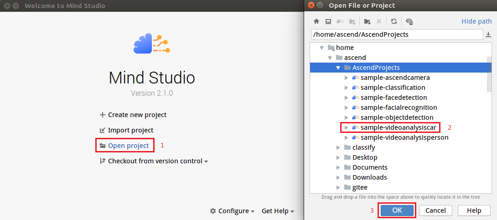

EN|[CN](Readme.md)

# Vehicle Detection<a name="ZH-CN_TOPIC_0208834984"></a>

Developers can deploy the application on the Atlas 200 DK or the AI acceleration cloud server to decode the local MP4 file or RTSP video streams, detect vehicles in video frames, predict their attributes, generate structured information, and send the structured information to the server for storage and display.

## Prerequisites <a name="zh-cn_topic_0203223303_section137245294533"></a>

Before using an open source application, ensure that:

-   Mind Studio  has been installed.
-   The Atlas 200 DK developer board has been connected to  Mind Studio, the cross compiler has been installed, the SD card has been prepared, and basic information has been configured.

## Software Preparation<a name="zh-cn_topic_0203223303_section8534138124114"></a>

Before running the application, obtain the source code package and configure the environment as follows.

1.  <a name="zh-cn_topic_0203223303_li953280133816"></a>Obtain the source code package.

    Download all the code in the sample-videoanalysiscar repository at [https://github.com/Atlas200DKTest/sample-videoanalysiscar/tree/1.3x.0.0/](https://github.com/Atlas200DKTest/sample-videoanalysiscar/tree/1.3x.0.0/) to any directory on Ubuntu Server where  Mind Studio  is located as the  Mind Studio  installation user, for example,  $HOME/AscendProjects/sample-videoanalysiscar.

2. <a name="zh-cn_topic_0203223303_li8221184418455"></a>Obtain the source network model required by the application.

    Obtain the source network model and its weight file used in the application by referring to  [Table 1](#zh-cn_topic_0203223303_table117203103464), and save them to any directory on the Ubuntu server where  Mind Studio  is located (for example,  **$HOME/models/videoanalysiscar**).

    ***Table  1**  Models used in the vehicle detection application

    <a name="zh-cn_topic_0203223303_table117203103464"></a>
    <table><thead align="left"><tr id="zh-cn_topic_0203223303_row4859191074617"><th class="cellrowborder" valign="top" width="17.32173217321732%" id="mcps1.2.4.1.1"><p id="zh-cn_topic_0203223303_p18859111074613"><a name="zh-cn_topic_0203223303_p18859111074613"></a><a name="zh-cn_topic_0203223303_p18859111074613"></a>Model Name</p>
    </th>
    <th class="cellrowborder" valign="top" width="9.68096809680968%" id="mcps1.2.4.1.2"><p id="zh-cn_topic_0203223303_p17859171013469"><a name="zh-cn_topic_0203223303_p17859171013469"></a><a name="zh-cn_topic_0203223303_p17859171013469"></a>Model Description</p>
    </th>
    <th class="cellrowborder" valign="top" width="72.997299729973%" id="mcps1.2.4.1.3"><p id="zh-cn_topic_0203223303_p1385991094614"><a name="zh-cn_topic_0203223303_p1385991094614"></a><a name="zh-cn_topic_0203223303_p1385991094614"></a>Model Download Path</p>
    </th>
    </tr>
    </thead>
    <tbody><tr id="zh-cn_topic_0203223303_row1085921012469"><td class="cellrowborder" valign="top" width="17.32173217321732%" headers="mcps1.2.4.1.1 "><p id="zh-cn_topic_0203223303_p168591710184613"><a name="zh-cn_topic_0203223303_p168591710184613"></a><a name="zh-cn_topic_0203223303_p168591710184613"></a>car_color</p>
    </td>
    <td class="cellrowborder" valign="top" width="9.68096809680968%" headers="mcps1.2.4.1.2 "><p id="zh-cn_topic_0203223303_p118591410204619"><a name="zh-cn_topic_0203223303_p118591410204619"></a><a name="zh-cn_topic_0203223303_p118591410204619"></a>Network model for identifying the vehicle color.</p>
    </td>
    <td class="cellrowborder" valign="top" width="72.997299729973%" headers="mcps1.2.4.1.3 "><p id="zh-cn_topic_0203223303_p11859310174613"><a name="zh-cn_topic_0203223303_p11859310174613"></a><a name="zh-cn_topic_0203223303_p11859310174613"></a>Download the source network model file and its weight file by referring to README.md in <a href="https://github.com/HuaweiAscendTest/models/tree/master/computer_vision/classification/car_color" target="_blank" rel="noopener noreferrer">https://github.com/HuaweiAscendTest/models/tree/master/computer_vision/classification/car_color</a></p>
    </td>
    </tr>
    <tr id="zh-cn_topic_0203223303_row78596105463"><td class="cellrowborder" valign="top" width="17.32173217321732%" headers="mcps1.2.4.1.1 "><p id="zh-cn_topic_0203223303_p118591910104615"><a name="zh-cn_topic_0203223303_p118591910104615"></a><a name="zh-cn_topic_0203223303_p118591910104615"></a>car_type</p>
    </td>
    <td class="cellrowborder" valign="top" width="9.68096809680968%" headers="mcps1.2.4.1.2 "><p id="zh-cn_topic_0203223303_p1685991044614"><a name="zh-cn_topic_0203223303_p1685991044614"></a><a name="zh-cn_topic_0203223303_p1685991044614"></a>Network model for identifying the vehicle brand.</p>
    <p id="zh-cn_topic_0203223303_p13859410184613"><a name="zh-cn_topic_0203223303_p13859410184613"></a><a name="zh-cn_topic_0203223303_p13859410184613"></a>It is a GoogLeNet model based on Caffe.</p>
    </td>
    <td class="cellrowborder" valign="top" width="72.997299729973%" headers="mcps1.2.4.1.3 "><p id="zh-cn_topic_0203223303_p1985915105461"><a name="zh-cn_topic_0203223303_p1985915105461"></a><a name="zh-cn_topic_0203223303_p1985915105461"></a>Download the source network model file and its weight file by referring to README.md in <a href="https://github.com/HuaweiAscendTest/models/tree/master/computer_vision/classification/car_type" target="_blank" rel="noopener noreferrer">https://github.com/HuaweiAscendTest/models/tree/master/computer_vision/classification/car_type</a></p>
    </td>
    </tr>
    <tr id="zh-cn_topic_0203223303_row1985913103461"><td class="cellrowborder" valign="top" width="17.32173217321732%" headers="mcps1.2.4.1.1 "><p id="zh-cn_topic_0203223303_p14859151016464"><a name="zh-cn_topic_0203223303_p14859151016464"></a><a name="zh-cn_topic_0203223303_p14859151016464"></a>car_plate_detection</p>
    </td>
    <td class="cellrowborder" valign="top" width="9.68096809680968%" headers="mcps1.2.4.1.2 "><p id="zh-cn_topic_0203223303_p108593100461"><a name="zh-cn_topic_0203223303_p108593100461"></a><a name="zh-cn_topic_0203223303_p108593100461"></a>Network model for identifying the license plate.</p>
    <p id="zh-cn_topic_0203223303_p1785921024614"><a name="zh-cn_topic_0203223303_p1785921024614"></a><a name="zh-cn_topic_0203223303_p1785921024614"></a>It is a MobileNet-SSD model based on Caffe.</p>
    </td>
    <td class="cellrowborder" valign="top" width="72.997299729973%" headers="mcps1.2.4.1.3 "><p id="zh-cn_topic_0203223303_p158596106460"><a name="zh-cn_topic_0203223303_p158596106460"></a><a name="zh-cn_topic_0203223303_p158596106460"></a>Download the source network model file and its weight file by referring to README.md in <a href="https://github.com/HuaweiAscendTest/models/tree/master/computer_vision/object_detect/car_plate_detection" target="_blank" rel="noopener noreferrer">https://github.com/HuaweiAscendTest/models/tree/master/computer_vision/object_detect/car_plate_detection</a>.</p>
    </td>
    </tr>
    <tr id="zh-cn_topic_0203223303_row08596101464"><td class="cellrowborder" valign="top" width="17.32173217321732%" headers="mcps1.2.4.1.1 "><p id="zh-cn_topic_0203223303_p178591510164619"><a name="zh-cn_topic_0203223303_p178591510164619"></a><a name="zh-cn_topic_0203223303_p178591510164619"></a>car_plate_recognition</p>
    </td>
    <td class="cellrowborder" valign="top" width="9.68096809680968%" headers="mcps1.2.4.1.2 "><p id="zh-cn_topic_0203223303_p1485911105469"><a name="zh-cn_topic_0203223303_p1485911105469"></a><a name="zh-cn_topic_0203223303_p1485911105469"></a>Network model for identifying the license plate number.</p>
    <p id="zh-cn_topic_0203223303_p17859191018468"><a name="zh-cn_topic_0203223303_p17859191018468"></a><a name="zh-cn_topic_0203223303_p17859191018468"></a>It is a CNN model based on Caffe.</p>
    </td>
    <td class="cellrowborder" valign="top" width="72.997299729973%" headers="mcps1.2.4.1.3 "><p id="zh-cn_topic_0203223303_p7859181094619"><a name="zh-cn_topic_0203223303_p7859181094619"></a><a name="zh-cn_topic_0203223303_p7859181094619"></a>Download the source network model file and its weight file by referring to README.md in <a href="https://github.com/HuaweiAscendTest/models/tree/master/computer_vision/classification/car_plate_recognition" target="_blank" rel="noopener noreferrer">https://github.com/HuaweiAscendTest/models/tree/master/computer_vision/classification/car_plate_recognition</a>.</p>
    </td>
    </tr>
    <tr id="zh-cn_topic_0203223303_row88591310124617"><td class="cellrowborder" valign="top" width="17.32173217321732%" headers="mcps1.2.4.1.1 "><p id="zh-cn_topic_0203223303_p685911013465"><a name="zh-cn_topic_0203223303_p685911013465"></a><a name="zh-cn_topic_0203223303_p685911013465"></a>vgg_ssd</p>
    </td>
    <td class="cellrowborder" valign="top" width="9.68096809680968%" headers="mcps1.2.4.1.2 "><p id="zh-cn_topic_0203223303_p1786011016461"><a name="zh-cn_topic_0203223303_p1786011016461"></a><a name="zh-cn_topic_0203223303_p1786011016461"></a>Network model for object detection.</p>
    <p id="zh-cn_topic_0203223303_p086018109465"><a name="zh-cn_topic_0203223303_p086018109465"></a><a name="zh-cn_topic_0203223303_p086018109465"></a>It is an SSD512 model based on Caffe.</p>
    </td>
    <td class="cellrowborder" valign="top" width="72.997299729973%" headers="mcps1.2.4.1.3 "><p id="zh-cn_topic_0203223303_p1186071044613"><a name="zh-cn_topic_0203223303_p1186071044613"></a><a name="zh-cn_topic_0203223303_p1186071044613"></a>Download the source network model file and its weight file by referring to README.md in <a href="https://github.com/HuaweiAscendTest/models/tree/master/computer_vision/object_detect/vgg_ssd" target="_blank" rel="noopener noreferrer">https://github.com/HuaweiAscendTest/models/tree/master/computer_vision/object_detect/vgg_ssd</a>.</p>
    </td>
    </tr>
    </tbody>
    </table>

3.   Log in to Ubuntu Server where Mind Studio is located as the Mind Studio installation user, confirm current DDK version and set the  environment variable  **DDK\_HOME**, **tools\_version**, **NPU\_DEVICE\_LIB** and **LD\_LIBRARY\_PATH**.

     1.  <a name="zh-cn_topic_0203223303_zh-cn_topic_0203223294_li61417158198"></a> Find current DDK version number.

         Current DDK version number can be obtained by either Mind studio tool or DDK packages.

         -    Using Mind studio tool.
        
              choose **File \> Settings \> System Settings \> Ascend DDK** from the main menu of Mind Studio, DDK version inquiry page will display as [Figure 1](zh-cn_topic_0203223294.md#fig94023140222).
            
              **Figure 1** DDK version inquiry page<a name="zh-cn_topic_0203223303_zh-cn_topic_0203223294_fig17553193319118"></a>  
              
    
              **DDK Version** shows in this page is current DDK version, for example, **1.31.T15.B150**.
             
         -   Using DDK package
             
             Obtain DDK version by installed DDK package name.
             
             The format of DDK package name is: **Ascend\_DDK-\{software version}-\{interface version}-x86\_64.ubuntu16.04.tar.gz**
             
             Where **software version** represents the DDK version.
             
             For example:
             
             If the name of DDK package is **Ascend\_DDK-1.31.T15.B150-1.1.1-x86\_64.ubuntu16.04.tar.gz**, the DDK version would be **1.31.T15.B150**.

     2.  Set the environment variable.
        
         **vim \~/.bashrc**
        
         Run the following commands to add the environment variables  **DDK\_HOME**  and  **LD\_LIBRARY\_PATH**  to the last line:

         **export tools\_version=_1.31.X.X_**

         **export DDK\_HOME=\\$HOME/.mindstudio/huawei/ddk/\\$tools\_version/ddk**

         **export NPU\_DEVICE\_LIB=$DDK\_HOME/../RC/host-aarch64\_Ubuntu16.04.3/lib**

         **export LD\_LIBRARY\_PATH=$DDK\_HOME/lib/x86\_64-linux-gcc5.4**

         > **NOTE：**   
         >-   **_1.31.X.X_** is the DDK version obtained from [Figure 1](#zh-cn_topic_0203223303_zh-cn_topic_0203223294_li61417158198), it needs be filled according to the inquiry result，for example, **1.31.T15.B150**  

         >-   If the environment variables have been added, this step can be skipped.

         Enter  **:wq!**  to save and exit.

         Run the following command for the environment variable to take effect:
         
         **source \~/.bashrc**

4.  Convert the source network to a model supported by Ascend AI processor. There are two ways for model conversion:  Mind Studio tool conversion and command line conversion.

    -   Model conversion using Mind Studio tool
        1.  Choose **Tool \> Convert** Model from the main menu of Mind Studio. The Convert Model page is displayed.
        2.  On the **Model** **Convert** page, perform model conversion configuration.
            -    Set **Model File** to model file installed in [Step 2](#zh-cn_topic_0203223303_li8221184418455), the weight file would be automatically matched and filled in **Weight File**.
            -    Set **Model Name** to model name in [Table 1](#zh-cn_topic_0203223303_table117203103464)
            -   The non-default configuration of **car\_color** model conversion is as follows:
           
                -   **car\_color\_inference** processes 10 images at a time. Therefore the value of **N** needs to be set to 10 during conversion.
                    **Figure 2**  Nodes configuration during **car\_color** model conversion.<a name="zh-cn_topic_0203223303_fig14958101714361"></a>  
                    
                    
                    
                -    **Input Image Size** in AIPP configuration needs to be modified to 256, 240, 128 \*16 alignment is required here, for **Model Image Format**, select BGR888\_U8.
              
                     

            -   The non-default configuration for **CAR\_TYPE** model conversion is as follows:
                
                **Input Image Size** in AIPP configuration needs to be modified to 256、224, 128 \*16 alignment is required here, for **Model Image Format**, select BGR888\_U8.
                
                **Figure 3**  AIPP configuration for **car\_type** model conversion<a name="zh-cn_topic_0203223303_fig193425535216"></a>  
                

            -   The non-default configuration for **car\_plate\_detection** model conversion is as follows:
            
                **Input Image Size** in AIPP configuration needs to be modified to 512、640, 128 \*16 alignment is required here, for **Model Image Format**, select BGR888\_U8.
             
                **Figure 4**  AIPP configuration for **car\_plate\_detection** model conversion<a name="zh-cn_topic_0203223303_fig1175817321825"></a>  
                
                

            -   The non-default configuration for **car\_plate\_recognition** model conversion is as follows:   
                 
                **Input Image Size** in AIPP configuration needs to be modified to 384、80, 128 \*16 alignment is required here, for **Model Image Format**, select BGR888\_U8.

                **图 5**  AIPP configuration for **car\_plate\_recognition** model conversion<a name="zh-cn_topic_0203223303_fig10486111811264"></a>  
                
                

            -   The non-default configuration for **vgg\_ssd** model conversion is as follows:

                **Model Image Format** needs to be set to BGR888\_U8。

                **Figure 6**  AIPP configuration for **vgg\_ssd** model conversion<a name="zh-cn_topic_0203223303_fig17951565245"></a>  
                
                

        3.  Click **OK** to start model conversion.
            
            During the conversion of the **car\_plate\_detection** and **vgg_ssd** models, the following error will be reported.
            
            **Figure 7**  Model conversion error<a name="zh-cn_topic_0203223303_fig1842765585311"></a>  
            

            
            
            Select **SSDDetectionOutput** from the **Suggestion** drop-down list box at the **DetectionOutput** layer and click Retry.

            After successful conversion, a **.om** offline model is generated in the $HOME/modelzoo/xxx/device.
            
            > **NOTE：**   
            
            >-   The specific meaning and parameter description in each step of Mind Studio model conversion can refer to[https://ascend.huawei.com/doc/mindstudio/2.1.0\(beta\)/zh/zh-cn\_topic\_0188462651.html](https://ascend.huawei.com/doc/mindstudio/2.1.0(beta)/zh/zh-cn_topic_0188462651.html)  
            >-   XXX indicates the name of currently converted model, for example, **car\_color.om** is saved at: $HOME/modelzoo/car\_color/device.
            
    -   Model conversion in command line mode:
        
        1.  Enter the folder where the source model is saved as the Mind Studio installation user.

            **cd $HOME/models/videoanalysiscar**
            
        2.  Using omg tool to run the following command to perform model conversion.

            ```
            ${DDK_HOME}/uihost/bin/omg --output="./XXX" --model="./XXX.prototxt" --framework=0 --ddk_version=${tools_version} --weight="./XXX.caffemodel" --input_shape=`head -1 $HOME/AscendProjects/sample-videoanalysiscar/MyModel/shape_XXX` --insert_op_conf=$HOME/AscendProjects/sample-videoanalysiscar/MyModel/aipp_XXX.cfg --op_name_map=$HOME/AscendProjects/sample-videoanalysiscar/MyModel/reassign_operators
            ```

            > **NOTE：**   
            
            >-  All files required for **input\_shape**、**insert\_op\_conf**、**op\_name\_mapare** are in the “sample-videoanalysiscar/MyModel” directory under the path where the source code is located，please configure these file paths according to the path where your actual source code is located.
            >-   **XXX** is the name of model in [Table 1](#zh-cn_topic_0203223303_table117203103464), please fill in the name of model to be converted during conversion. The **car\_plate\_recognition**、**car\_type**、**car\_color** does not need the **op\_name\_map** parameter for model conversion. An error will be reported during model conversion if the unnecessary parameters are not deleted.
            >-   The specific meaning of each parameter can be found in the following documents[https://ascend.huawei.com/doc/Atlas200DK/1.3.0.0/zh/zh-cn\_topic\_0165968579.html](https://ascend.huawei.com/doc/Atlas200DK/1.3.0.0/zh/zh-cn_topic_0165968579.html)  
            
5.  Upload the converted model file（.om file）to “**sample-videoanalysiscar/script**” directory  in the source code path in [Step 1](#zh-cn_topic_0203223303_li953280133816)

## Compile<a name="zh-cn_topic_0203223303_section1759513564117"></a>

1.  Open the corresponding project.
    
    Enter the “**MindStudio-ubuntu/bin**” directory after decompressing the installation package in the command line, for example, $HOME/MindStudio-ubuntu/bin. Execute the following command to start Mind Studio:

    **./MindStudio.sh**

    After successfully starting Mind Studio, open **sample-videoanalysisperson** project，as shown in [Figure 8](#en-us_topic_0182554628_fig138681281084)

    **Figure 8**  Open videoanalysisperson project<a name="en-us_topic_0182554628_fig138681281084"></a>  
    
    
    以Mind Studio安装用户在命令行中进入安装包解压后的“MindStudio-ubuntu/bin”目录，如：$HOME/MindStudio-ubuntu/bin。执行如下命令启动Mind Studio

    **./MindStudio.sh**

    启动成功后，打开**sample-videoanalysiscar**工程，如[图8](#zh-cn_topic_0203223303_fig721144422212)所示。

    **图 8**  打开sample-videoanalysiscar工程<a name="zh-cn_topic_0203223303_fig721144422212"></a>  
    

    

2.  在src/param\_configure.conf文件中配置相关工程信息。

    **图 9**  配置文件路径<a name="zh-cn_topic_0203223303_fig1557065718252"></a>  
    

    

    该配置文件内容如下：

    ```
    remote_host=
    presenter_view_app_name=
    video_path_of_host=
    rtsp_video_stream=
    ```

    需要手动添加参数配置:

    -   remote\_host：配置为Atlas 200 DK开发者板的IP地址。
    -   presenter\_view\_app\_name: 用户自定义的在PresenterServer界面展示的View Name，此View Name需要在Presenter Server展示界面唯一，只能为大小写字母、数字、“\_”的组合，位数3\~20。
    -   video\_path\_of\_host：配置为HOST侧的视频文件的绝对路径。
    -   rtsp\_video\_stream：配置为RTSP视频流的URL。

    视频文件配置示例如下：

    ```
    remote_host=192.168.1.2
    presenter_view_app_name=video
    video_path_of_host=/home/HwHiAiUser/car.mp4
    rtsp_video_stream=
    ```

    Rtsp视频流配置示例如下：

    ```
    remote_host=192.168.1.2
    presenter_view_app_name=video
    video_path_of_host=
    rtsp_video_stream=rtsp://192.168.2.37:554/cam/realmonitor?channel=1&subtype=0
    ```

    > **说明：**   
    >-   参数_remote\_host__和_presenter\_view\_app\_name:必须全部填写，否则无法通过build。  
    >-   注意所填参数不用使用“”。  
    >-   参数video\_path\_of\_host和rtsp\_video\_stream必须至少填写一项  
    >-   当前RTSP视频流只支持rtsp://ip:port/path格式，如果需要使用其它格式的url，需要把video\_decode.cpp中的IsValidRtsp函数去除，或者直接返回true，跳过正则表达式匹配。  
    >-   本样例中提供的RTSP流地址不可以直接使用。如果需要使用RTSP，请在本地使用live555或其它方式制作RTSP视频流，并且可以在VLC中播放。然后将本地制作好的RTSP视频流的URL填入配置文件的相应参数中，即可运行。  

3.  开始编译，打开Mind Studio工具，在工具栏中点击**Build \> Build \> Build-Configuration**。如[图10](#zh-cn_topic_0203223303_fig13819202814301)所示，会在目录下生成build和run文件夹。

    **图 10**  编译操作及生成文件<a name="zh-cn_topic_0203223303_fig13819202814301"></a>  
    

    

    > **说明：**   
    >首次编译工程时，**Build \> Build**为灰色不可点击状态。需要点击**Build \> Edit Build Configuration**，配置编译参数后再进行编译。  
    >  

4.  <a name="zh-cn_topic_0203223303_li499911453439"></a>启动Presenter Server。

    打开Mindstudio工具的Terminal，此时默认在[步骤1](#zh-cn_topic_0203223303_li953280133816)中的代码存放路径下，执行如下命令在后台启动Video Analysiscar应用的Presenter Server主程序。如[图 启动PresenterServer](zh-cn_topic_0203223303.md#fig423515251067)所示。

    **bash run\_present\_server.sh**

    **图 11**  启动PresenterServer<a name="zh-cn_topic_0203223303_fig102142024389"></a>  
    

    

    -   当提示“Please choose one to show the presenter in browser\(default: 127.0.0.1\):“时，请输入在浏览器中访问Presenter Server服务所使用的IP地址（一般为访问Mind Studio的IP地址）。

        如[图12](#zh-cn_topic_0203223303_fig73590910118)所示，请在“Current environment valid ip list“中选择通过浏览器访问Presenter Server服务使用的IP地址，并输入存储视频解析数据的路径。

        **图 12**  工程部署示意图<a name="zh-cn_topic_0203223303_fig73590910118"></a>  
        

        

    -   当提示“Please input a absolute path to storage video analysis data:“时，请输入Mind Studio中的绝对路径用于存储视频解析数据，此路径Mind Studio用户需要有读写权限，若此路径不存在，脚本会自动创建。

    如[图13](#zh-cn_topic_0203223303_fig19953175965417)所示，表示presenter\_server的服务启动成功。

    **图 13**  Presenter Server进程启动<a name="zh-cn_topic_0203223303_fig19953175965417"></a>  
    

    

    使用上图提示的URL登录Presenter Server，仅支持Chrome浏览器，IP地址为[图12](#zh-cn_topic_0203223303_fig73590910118)中输入的IP地址，端口号默为7005，如下图所示，表示Presenter Server启动成功。

    **图 14**  主页显示<a name="zh-cn_topic_0203223303_fig129539592546"></a>  
    

    Presenter Server、Mind Studio与Atlas 200 DK之间通信使用的IP地址示例如下图所示：

    **图 15**  IP地址示例<a name="zh-cn_topic_0203223303_fig195318596543"></a>  
    

    -   Atlas 200 DK开发者板使用的IP地址为192.168.1.2（USB方式连接）。
    -   Presenter Server与Atlas 200 DK通信的IP地址为UI Host服务器中与Atlas 200 DK在同一网段的IP地址，例如：192.168.1.223。
    -   通过浏览器访问Presenter Server的IP地址本示例为：10.10.0.1，由于Presenter Server与Mind Studio部署在同一服务器，此IP地址也为通过浏览器访问Mind Studio的IP。

5.  车辆检测应用支持解析本地视频和RTSP视频流。
    -   如果需要解析本地视频，需要将视频文件传到Host侧。

        例如将视频文件car.mp4上传到Host侧的“/home/HwHiAiUser/“目录下。

        > **说明：**   
        >支持H264与H265格式的MP4文件，如果MP4文件需要剪辑，建议使用开源工具ffmpeg，使用其他工具剪辑的视频文件ffmpeg工具可能不支持解析。  

    -   如果仅解析RTSP视频流，本步骤可跳过。


## 运行<a name="zh-cn_topic_0203223303_section6245151616426"></a>

1.  运行车辆检测应用程序

    在Mindstudio工具的工具栏中找到Run按钮，点击**Run \> Run 'sample-videoanalysiscar'**，如[图16](#zh-cn_topic_0203223303_fig12953163061713)所示，可执行程序已经在开发板执行。

    **图 16**  程序运行示意图<a name="zh-cn_topic_0203223303_fig12953163061713"></a>  
    

    

2.  使用启动Presenter Server服务时提示的URL登录 Presenter Server 网站（仅支持Chrome浏览器），详细可参考[4](#zh-cn_topic_0203223303_li499911453439)。

    > **说明：**   
    >车辆检测应用的Presenter Server最多支持2个  _presenter\_view\_app\_name_  同时显示。  

    页面左侧树结构列出了视频所属app name以及通道名，中间列出了抽取的视频帧大图以及检测出的目标小图，点击下方小图后会在右侧列出详细的推理结果、评分。

    本应用支持车辆属性检测，包括车辆品牌、车辆颜色的识别和车牌号码识别。

    > **说明：**   
    >车牌号码识别的网络模型，是通过程序自动生成的车牌作为训练集图片训练的，不是使用真实车牌图片训练的。所以该模型在识别真实车牌号码时准确度比较低，如果需要较高的准确度的模型，请自己搜集真实车牌图片作为训练集并训练。  


## 后续处理<a name="zh-cn_topic_0203223303_section1092612277429"></a>

-   **停止车辆检测应用**

    视频程序分析完之后会自动退出，如[图17](#zh-cn_topic_0203223303_fig464152917203)所示。

    **图 17**  Video Analysiscar应用程序运行结束<a name="zh-cn_topic_0203223303_fig464152917203"></a>  
    

    

-   **停止Presenter Server服务**

    Presenter Server服务启动后会一直处于运行状态，若想停止车辆检测应用对应的Presenter Server服务，可执行如下操作。

    以Mind Studio安装用户在Mind Studio所在服务器的命令行中执行如下命令查看车辆检测应用对应的Presenter Server服务的进程。

    **ps -ef | grep presenter | grep video\_analysis\_car**

    ```
    ascend@ascend-HP-ProDesk-600-G4-PCI-MT:~/sample-videoanalysiscar$ ps -ef | grep presenter | grep video_analysis_car
    ascend 3655 20313 0 15:10 pts/24?? 00:00:00 python3 presenterserver/presenter_server.py --app video_analysis_car
    ```

    如上所示  _3655_  即为车辆检测应用对应的Presenter Server服务的进程ID。

    若想停止此服务，执行如下命令：

    **kill -9** _3655_

-   **重启车辆检测应用时注意点**

    重新启动车辆检测应用时请确保以下条件满足任意一个，否则会报错:

    1.  请确保视频解析数据存储路径中内容已经清空。

        例如：视频解析数据存储路径为\\$HOME/videocar\_storage/video，其中\\$HOME/videocar\_storage是执行[步骤4](#zh-cn_topic_0203223303_li499911453439)时配置的“Please input a absolute path to storage video analysis data”的值，video为**param\_configure.conf**配置文件中参数**presenter\_view\_app\_name**的值。

        满足此条件情况下，无需重启Presenter Server，直接重新执行**Run \> Run 'sample-videoanalysiscar'**运行应用程序即可。

    2.  视频解析数据存储路径中如果已有数据且不想删除，可以修改**param\_configure.conf**配置文件中**presenter\_view\_app\_name**参数的值，然后在Mind Studio界面中重新执行**Build \> Rebuild**，再执行**Run \> Run** **'sample-videoanalysiscar'**即可。

        **param\_configure.conf**配置文件中参数**presenter\_view\_app\_name**的值如下所示。

        

        满足此条件情况下，无需重启Presenter Server。

    3.  若重新启动Presenter Server，再运行车辆检测应用，在启动Presenter Server时请修改存储视频解析的数据的路径（不与之前存储路径重复），请参考[步骤4](#zh-cn_topic_0203223303_li499911453439)。


