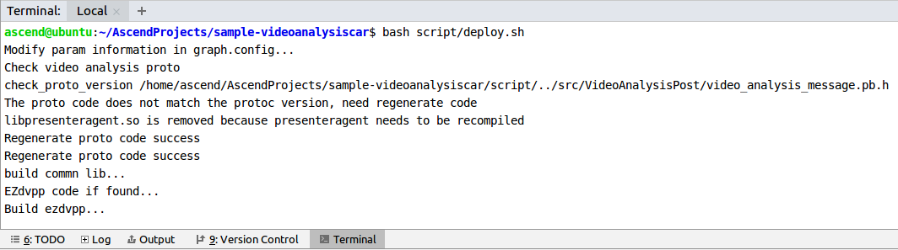
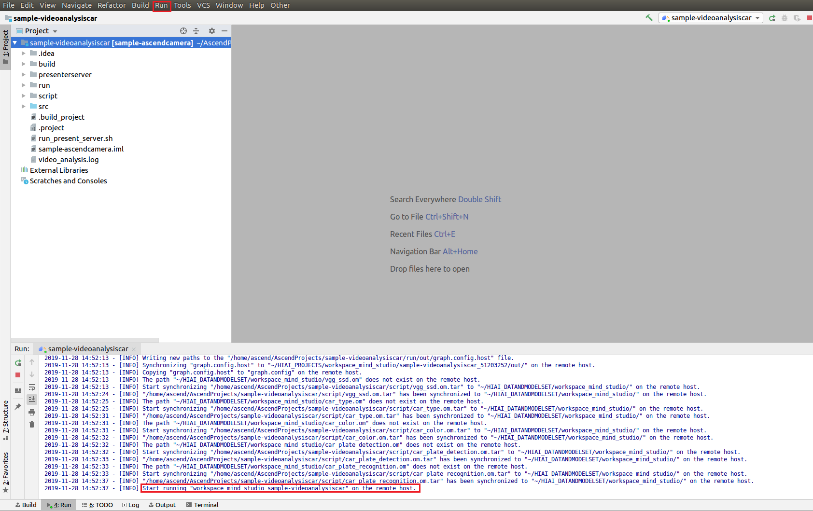
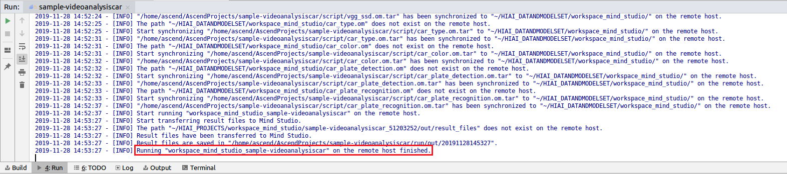
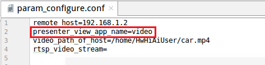

EN|[CN](Readme.md)

# Vehicle Detection<a name="ZH-CN_TOPIC_0208834984"></a>

Developers can deploy the application on the Atlas 200 DK or the AI acceleration cloud server to decode the local MP4 file or RTSP video streams, detect vehicles in video frames, predict their attributes, generate structured information, and send the structured information to the server for storage and display.

## Prerequisites <a name="zh-cn_topic_0203223303_section137245294533"></a>

Before using an open source application, ensure that:

-   Mind Studio  has been installed.
-   The Atlas 200 DK developer board has been connected to  Mind Studio, the cross compiler has been installed, the SD card has been prepared, and basic information has been configured.
## Deployment
1. Deployment: choose either faster deployment or conventional deployment as shown below: 

   1.1 Faster deployment, refer to https://github.com/Atlas200DKTest/faster-deploy.git .
    > **NOTE：**   
    >-   This faster deployment script can quickly deploy multiple cases, select videoanalysiscar case for this project.
    >-   This faster deployment automatically performs code download, model conversion and environment variable configuration. For details, choose conventional deployment method, as shown in 1.2.
    
   1.2 Conventional deployment, refer to : https://github.com/Atlas200DKTest/sample-README/tree/master/sample-videoanalysiscar .
    > **NOTE：**   
    >-   This deployment method requires manually performing code download, model conversion and environment variable configuration. A better understand of the deployment process can be obtained from this method.


## Compile<a name="zh-cn_topic_0203223303_section1759513564117"></a>

1.  Open the corresponding project.
    
    Enter the “**MindStudio-ubuntu/bin**” directory after decompressing the installation package in the command line, for example, **$HOME/MindStudio-ubuntu/bin**. Run the following command to start **Mind Studio**:

    **./MindStudio.sh**

    After successfully starting **Mind Studio**, open **sample-videoanalysiscar** project，as shown in [Figure 1](#zh-cn_topic_0203223303_fig721144422212)

    **Figure 1**  Open videoanalysisperson project<a name="zh-cn_topic_0203223303_fig721144422212"></a>  
    

2.  Configure related project information in the **src/param\_configure.conf**


    **Figure 2**  Configuration file path<a name="zh-cn_topic_0203223303_fig1557065718252"></a>  
    
   
    
    The configuration file is as follows:

    ```
    remote_host=
    presenter_view_app_name=
    video_path_of_host=
    rtsp_video_stream=
    ```
    
    Following parameter configuration needs to be added manually：

    -   remote\_host：this parameter indicates the IP address of Atlas 200 DK developer board.
    -   presenter\_view\_app\_name: The user-defined View Name on the PresenterServer interface, this View Name needs to be unique  on the Presenter Server. It can only be a combination of uppercase and lowercase letters, numbers, and "\_", with a digit of 3 \~20.
    -   video\_path\_of\_host：absolute path of video file on the HOST.
    -   rtsp\_video\_stream：URL of RTSP video streams.
    
    An example of video file configuration is as follows:
   

    ```
    remote_host=192.168.1.2
    presenter_view_app_name=video
    video_path_of_host=/home/HwHiAiUser/car.mp4
    rtsp_video_stream=
    ```
    An example of Rtsp video streams configuration is as follows:


    ```
    remote_host=192.168.1.2
    presenter_view_app_name=video
    video_path_of_host=
    rtsp_video_stream=rtsp://192.168.2.37:554/cam/realmonitor?channel=1&subtype=0
    ```

    > **NOTE：**   
    >-   The parameters **_remote\_host__** and **presenter\_view\_app\_name**: must be filled in，otherwise build cannot be passed.
    >-   Note that the "" symbol is no need to be used when filling in parameters.
    >-   At least one of the parameters **video\_path\_of\_host** and **rtsp\_video\_stream** must be filled in.
    >-   Current RTSP video streams only support rtsp://ip:port/path format, if other urls format is need to be used, the **IsValidRtsp**  function in the **video\_decode.cpp** should be removed, or directly return true to skip regular expression matching.
    >-   The RTSP streams address in this example cannot be used directly. If you need to use RTSP, please use live555 or other methods to make RTSP video streams locally, and it can be played in VLC, then fill the URL of the locally made RTSP video streams into the corresponding parameters of the configuration file.  

3.  Run the deployment script to adjust the configuration parameters, download and compile 3rd party libraries. Open the Terminal of **Mind Studio** tool, which is under the main code directory, run the following command to execute environment deployment in the backstage, as shown in [Figure 3](#zh-cn_topic_0182554577_fig19292258105419).
    
    **Figure 3**  Execute deployment script<a name="zh-cn_topic_0182554577_fig19292258105419"></a>  
    
    
    
    > **NOTE：**   
    >-   Automatic download and compilation will perform if 3rd party libraries are not deployed for the first time of deployment. This process might take some time, please wait patiently. It will not download and compilation repeatedly when recompiling later, deployment is shown as above. 
    >-   Select the HOST IP connected to the developer board when deploying, which is usually the IP of virtual network card. If this IP belongs to the same segment as the developer board IP, it will be selected automatically and deployed. Otherwise, manual entering the IP connected to developer board is required for deployment.


4.  Begin to compile, open **Mind Studio** tool, click **Build \> Build \> Build-Configuration** in the toolbar, shown as [Figure 4](#zh-cn_topic_0203223303_fig13819202814301), **build** and **run** folders will be generated under the directory.

    **Figure 4**  Compilation operation and generated files<a name="zh-cn_topic_0203223303_fig13819202814301"></a>  
    

    

    > **NOTE：**   
    >When you compile the project for the first time, **Build \> Build** is gray and not clickable. Your need to click **Build \> Edit Build Configuration**, configure the compilation parameters and then compile.  
    >  

4.  <a name="zh-cn_topic_0203223303_li499911453439"></a>Start Presenter Server.

    Open **Terminal** of **Mind Studio** tool, it is in the path where code saved in [Step 1](#zh-cn_topic_0203223303_li953280133816) by default, run the following command to start the **Presenter Server** main program of the **Video Analysiscar** application, as shown in [Figure 5](zh-cn_topic_0203223303.md#fig423515251067).

    **bash run\_present\_server.sh**

    **Figure 5**  Start PresenterServer<a name="zh-cn_topic_0203223303_fig102142024389"></a>  
    

    
    
    -   When the message "Please choose one to show the presenter in browser (default: 127.0.0.1):" is displayed, enter the IP address used for accessing the **Presenter Server** service in the browser. Generally, the IP address is the IP address for accessing the **Mind Studio** service.
    
        As shown in [Figure 6](#zh-cn_topic_0203223303_fig73590910118), Select the IP address used by the browser to access the Presenter Server service in **"Current environment valid ip list"** and enter the path for storing video analysis data.

        **Figure 6**  Project deployment<a name="zh-cn_topic_0203223303_fig73590910118"></a>  
        

        
    
    -   When the message **"Please input an absolute path to storage video analysis data:"** is displayed, enter the absolute path for storing video analysis data in **Mind Studio**. The **Mind Studio** user must have the read and write permissions. If the path does not exist, the script is automatically created.
    

    As shown in [Figure 7](#zh-cn_topic_0203223303_fig19953175965417) it means **presenter\_server**  service starts successfully.

    **Figure 7**  Starting the Presenter Server process<a name="zh-cn_topic_0203223303_fig19953175965417"></a>  
    

    
    
    Use the URL shown in the preceding figure to log in to **Presenter Server** (only the Chrome browser is supported). The IP address is that entered in [Figure 6](#zh-cn_topic_0203223303_fig73590910118) and the default port number is 7005. The following figure indicates that **Presenter Server** is started successfully.
    
   
     **Figure 8**  Home page<a name="zh-cn_topic_0203223303_fig129539592546"></a>  
    
     
    The following figure shows the IP address used by the **Presenter Server** and **Mind Studio** to communicate with the Atlas 200 DK.
    
    **Figure 9**  Example IP Address<a name="zh-cn_topic_0203223303_fig195318596543"></a>  
    

    -   The IP address of the Atlas 200 DK developer board is 192.168.1.2 (connected in USB mode).
    -   The IP address used by the **Presenter Server** to communicate with the Atlas 200 DK is in the same network segment as the IP address of the Atlas 200 DK on the UI Host server. For example: 192.168.1.223.
    -   The following is an example of accessing the IP address of the **Presenter Server** using a browser: 10.10.0.1, because the Presenter Server and **Mind Studio** are deployed on the same server, the IP address is also the IP address for accessing the Mind Studio through the browser.

5.  Car detection application can parse local videos and RTSP video streams.
    -    To parse a local video, upload the video file to the Host.

         For example, upload the video file **car.mp4** to the **"/home/HwHiAiUser/"** directory on the host.

         > **NOTE：**   
         >H264 and H265 format MP4 files are supported，the open source tool FFmpeg is recommended if MP4 files need to be edited, because FFmpeg tools may fail to parse video files edited using other tools.
        
     -   if you only parse RTSP video streams, this step can be skipped.


## Running<a name="zh-cn_topic_0203223303_section6245151616426"></a>

1.  Run the Car Detection application


    Find **Run** button in the toolbar of **Mind Studio** tool, click **Run \> Run 'sample-videoanalysiscar'**, as shown in [Figure 10](#zh-cn_topic_0203223303_fig12953163061713), the executable program has been executed on the developer board.


    **Figure 10**  Executed program<a name="zh-cn_topic_0203223303_fig12953163061713"></a>  
    

    

2.  Log in to the **Presenter Server** website using the URL promoted when starting the **Presenter Server** service（only supports Chrome browser）, for details, please refer to [Step 5](#zh-cn_topic_0203223303_li499911453439)。

    > **NOTE：**   
    >**Presenter Server** of car detection supports up to two **_presenter\_view\_app\_name_** to display at the same time.

    The navigation tree on the left displays the **app name** and channel name of the video. The large image of the extracted video frame   and the detected target small image are displayed in the middle. After you click the small image, the detailed inference result and score are displayed on the right.
    
    This application supports car attribute detection, including identification of vehicle brands, vehicle colors, and license plates.

    > **NOTE：**   
    >In the network model of license plate recognition, the license plate images automatically generated by the program are trained as the training set, instead of using real license plate images. Therefore, this model has low accuracy in identifying real license plate numbers. If a high-accuracy model is required, collect real license plate images as the training set and train them.


## Follow-up Operations<a name="zh-cn_topic_0203223303_section1092612277429"></a>

-   **Stopping Car Detection Application**

     After the video program is analyzed, it will automatically stop and exit, as shown in[Figure 11](#zh-cn_topic_0203223303_fig464152917203).

    **Figure 11**  Video Analysiscar application stops<a name="zh-cn_topic_0203223303_fig464152917203"></a>  
    

    

-   **Stopping Presenter Server service**

    The **Presenter Server** service is always in the running state after being started. To stop the **Presenter Server** service of the car detection application, perform the following operations: 

    Run the following command to check the process of the **Presenter Server** service corresponding to the car detection application as the **Mind Studio** installation user:

    **ps -ef | grep presenter | grep video\_analysis\_car**

    ```
    ascend@ascend-HP-ProDesk-600-G4-PCI-MT:~/sample-videoanalysiscar$ ps -ef | grep presenter | grep video_analysis_car
    ascend 3655 20313 0 15:10 pts/24?? 00:00:00 python3 presenterserver/presenter_server.py --app video_analysis_car
    ```

    In the preceding information,  _3655_  indicates the process ID of the Presenter Server service corresponding to the car detection application.

    To stop the service, run the following command:

    **kill -9** _3655_

-   **Note on restarting Car Detection application**

    Please ensure that any of the following conditions are met when restarting the car detection application, otherwise an error will be reported:
    
    1.   Make sure the content in the path for saving video parsing data has been emptied:
    
         For example, the path for saving video parsing data is **\\$HOME/videocar\_storage/video**，where **\\$HOME/videocar\_storage** is the value of **"Please input a absolute path to storage video analysis data"** configured in [Step 5](#zh-cn_topic_0203223303_li499911453439), and video is the value of parameter **presenter\_view\_app\_name** in **param\_configure.conf** configuration file.

         When this condition is met, there is no need to restart the **Presenter Server**. Directly re-run **Run \> Run 'sample-videoanalysiscar'** to run the program.

    2.  If data has been saved in the video parsing saving path and you do not want to delete it, simply modify  the value of parameter **presenter\_view\_app\_name** in **param\_configure.conf** configuration file, and re-run **Build \> Rebuild** on the **Mind Studio** interface，then run **'sample-videoanalysiscar'**.

        The value of parameter **presenter\_view\_app\_name** in the **param\_configure.conf** configuration file is shown as below:

        

        When this condition is met, there is no need to restart the **Presenter Server**.

    3.  if restart the **Presenter Server** and then run the car detection application, please modify the path for saving the video parsing data when starting **Presenter Server**（do not duplicate the previous saving path），refer to [Step 5](#zh-cn_topic_0203223303_li499911453439).


